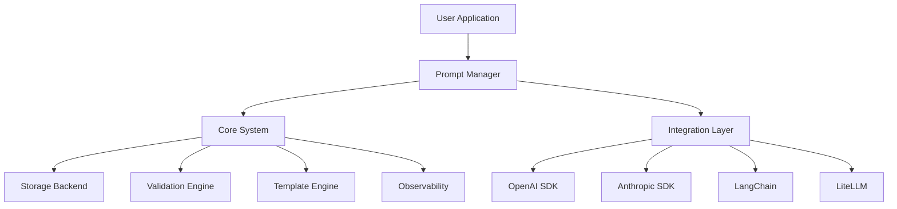
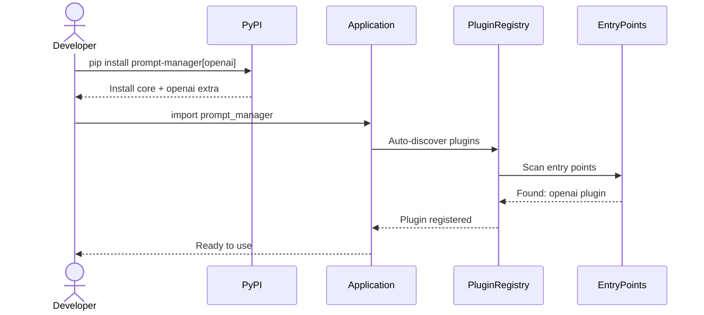
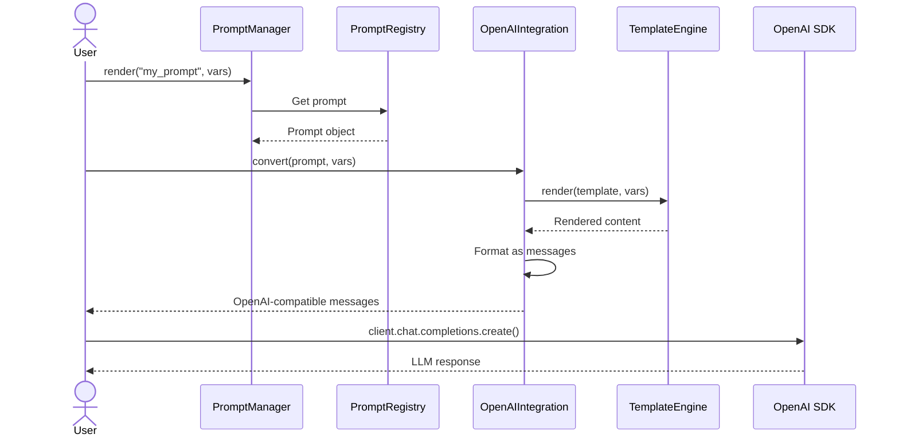
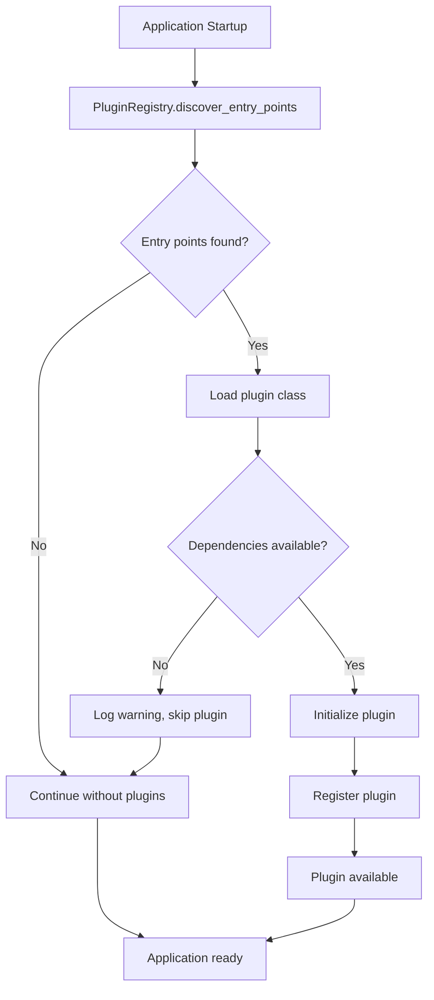

# Design Document: Package Completion for Production Release

## Overview

This design document outlines the architecture and implementation plan for completing the Prompt Manager package for production-ready PyPI distribution. The package transforms from a functional codebase into a professional, distributable Python library with seamless framework integrations (OpenAI, Anthropic, LangChain, LiteLLM), comprehensive documentation, and automated publishing workflows.

### Design Goals

- **Maintain existing architecture**: Leverage the robust Protocol-based plugin system already in place
- **Zero breaking changes**: All current functionality remains intact and backward compatible
- **Progressive enhancement**: Add framework integrations as optional dependencies
- **Developer experience first**: Clear error messages, type hints, and auto-discovery
- **Production quality**: Comprehensive testing, security scanning, and automated releases

### What We're NOT Doing

**CRITICAL**: Explicitly document out-of-scope items to prevent scope creep.

- NOT implementing LLM API calls directly - package manages prompts, frameworks handle API calls
- NOT building a web dashboard or admin UI - CLI and programmatic API only
- NOT migrating existing prompt formats from other systems - users define prompts in our format
- NOT implementing database storage backends (PostgreSQL, Redis) - filesystem and in-memory only for v1.0
- NOT building REST API server - Python package/library only
- NOT implementing A/B testing or analytics - basic metrics collection only
- NOT creating hosted/cloud version - self-hosted library only
- NOT supporting Python versions below 3.11 - modern Python only
- NOT implementing custom LLM client wrappers - use existing framework clients

**Why This Matters**: This feature focuses on packaging, distribution, and integration patterns. Advanced features like database backends, hosted services, and analytics are intentionally deferred to maintain focus on core distribution and framework integration.

### Technology Stack

- **Language**: Python 3.11+ (using modern typing features including `TypedDict`, `Protocol`, `TypeVar`)
- **Build System**: Poetry 1.8+ for dependency management and publishing
- **Core Dependencies**:
  - Pydantic v2.10+ (validation and serialization)
  - PyYAML 6.0+ (schema loading)
  - pybars4 0.9+ (Handlebars templating)
  - aiofiles 24.1+ (async file I/O)
  - structlog 24.4+ (structured logging)
  - OpenTelemetry 1.28+ (observability)
- **Optional Framework Dependencies**:
  - openai ^1.57.0 (OpenAI SDK integration)
  - anthropic ^0.42.0 (Anthropic SDK integration)
  - langchain-core ^0.3.0 (LangChain integration)
  - litellm ^1.53.0 (LiteLLM integration)
- **Development Tools**:
  - pytest 8.3+ (testing framework)
  - mypy 1.13+ (strict type checking)
  - ruff 0.8+ (linting)
  - black 24.10+ (formatting)
  - bandit 1.8+ (security scanning)
- **CI/CD**: GitHub Actions for automated testing and PyPI publishing

## Architecture

### System Context

The Prompt Manager sits between user applications and LLM frameworks, providing centralized prompt management with versioning, validation, and observability.



### Current State Analysis

**Existing Architecture** (from codebase analysis):

The codebase already has a solid foundation:

1. **Protocol-Based Design** (`src/prompt_manager/core/protocols.py`):
   - `PluginProtocol` - Framework integration interface
   - `StorageBackendProtocol` - Storage abstraction
   - `TemplateEngineProtocol` - Template rendering
   - `ObserverProtocol` - Lifecycle hooks
   - `CacheProtocol` - Caching layer
   - `MetricsCollectorProtocol` - Metrics collection

2. **Plugin Infrastructure** (`src/prompt_manager/plugins/`):
   - `BasePlugin` - Abstract base class for framework plugins
   - `PluginRegistry` - Plugin discovery and management
   - Entry point support for auto-discovery (configured in `pyproject.toml`)

3. **Core Components** (`src/prompt_manager/core/`):
   - `Prompt` model with Pydantic v2 validation
   - `PromptManager` - Main orchestrator with rendering and versioning
   - `PromptRegistry` - In-memory prompt storage with filtering
   - `TemplateEngine` - Handlebars rendering with Pybars4
   - Support for TEXT, CHAT, COMPLETION, INSTRUCTION formats

4. **Storage Layer** (`src/prompt_manager/storage/`):
   - `InMemoryStorage` - Fast in-memory backend
   - `FileSystemStorage` - JSON persistence
   - `YAMLLoader` - Directory-based prompt loading

5. **Validation System** (`src/prompt_manager/validation/`):
   - Schema-based validation with YAML definitions
   - Input/output schema injection during rendering
   - 11 field types, 10 validator types

6. **Observability** (`src/prompt_manager/observability/`):
   - Structured logging with structlog
   - Metrics collection
   - OpenTelemetry integration

7. **Package Structure**:
   - Already uses src-layout: `src/prompt_manager/`
   - `pyproject.toml` configured with Poetry
   - Optional extras defined but not populated with dependencies
   - Entry points defined but no plugins registered yet

**What Needs To Be Added**:

1. **Framework Integration Modules** - New directory `src/prompt_manager/integrations/`
2. **Type Marker File** - `src/prompt_manager/py.typed` for PEP 561
3. **Integration Plugins** - Concrete implementations for OpenAI, Anthropic, LangChain, LiteLLM
4. **LICENSE File** - MIT license text
5. **Distribution Documentation** - RELEASING.md, CONTRIBUTING.md
6. **Example Integrations** - Working examples for each framework
7. **Integration Tests** - Test suite for framework integrations
8. **CI/CD Workflows** - GitHub Actions for testing and publishing

### Component Boundaries

- **Core Package** (`src/prompt_manager/core/`): Prompt management, versioning, validation
- **Storage Layer** (`src/prompt_manager/storage/`): Persistence backends
- **Integration Layer** (`src/prompt_manager/integrations/`): Framework-specific adapters (NEW)
- **Plugin System** (`src/prompt_manager/plugins/`): Plugin discovery and registry
- **Observability** (`src/prompt_manager/observability/`): Logging, metrics, tracing
- **Validation** (`src/prompt_manager/validation/`): Schema validation engine
- **Examples** (`examples/integrations/`): Framework integration examples (NEW)
- **Tests** (`tests/integrations/`): Integration test suite (NEW)

## Components and Interfaces

### New Integration Layer

#### Directory Structure

```
src/prompt_manager/integrations/
├── __init__.py           # Public API exports
├── base.py               # BaseIntegration abstract class
├── openai.py             # OpenAI SDK integration
├── anthropic.py          # Anthropic SDK integration
├── langchain.py          # LangChain integration
├── litellm.py            # LiteLLM integration
└── utils.py              # Shared utilities
```

#### BaseIntegration Class

```python
# src/prompt_manager/integrations/base.py
from abc import ABC, abstractmethod
from collections.abc import Mapping
from typing import Any, Generic, TypeVar

from prompt_manager.core.models import Prompt
from prompt_manager.core.protocols import TemplateEngineProtocol
from prompt_manager.exceptions import IntegrationError

T = TypeVar('T')  # Framework-specific output type

class BaseIntegration(ABC, Generic[T]):
    """
    Base class for framework integrations.

    Provides common functionality for converting Prompt Manager prompts
    to framework-specific formats.
    """

    def __init__(
        self,
        template_engine: TemplateEngineProtocol,
        *,
        strict_validation: bool = True,
    ) -> None:
        """
        Initialize integration.

        Args:
            template_engine: Template engine for rendering
            strict_validation: Raise errors on incompatible prompts
        """
        self.template_engine = template_engine
        self.strict_validation = strict_validation

    @abstractmethod
    async def convert(
        self,
        prompt: Prompt,
        variables: Mapping[str, Any],
    ) -> T:
        """
        Convert prompt to framework-specific format.

        Args:
            prompt: Prompt to convert
            variables: Variables for rendering

        Returns:
            Framework-specific prompt object

        Raises:
            IntegrationError: If conversion fails
        """
        ...

    @abstractmethod
    def validate_compatibility(self, prompt: Prompt) -> bool:
        """
        Check if prompt is compatible with framework.

        Args:
            prompt: Prompt to validate

        Returns:
            True if compatible
        """
        ...
```

#### OpenAI Integration

```python
# src/prompt_manager/integrations/openai.py
from collections.abc import Mapping
from typing import Any, TypedDict

from prompt_manager.core.models import Prompt, PromptFormat, Role
from prompt_manager.integrations.base import BaseIntegration
from prompt_manager.exceptions import IntegrationError

class OpenAIMessage(TypedDict, total=False):
    """OpenAI message format."""
    role: str
    content: str
    name: str | None
    function_call: dict[str, Any] | None
    tool_calls: list[dict[str, Any]] | None

class OpenAIIntegration(BaseIntegration[list[OpenAIMessage] | str]):
    """Integration for OpenAI SDK."""

    async def convert(
        self,
        prompt: Prompt,
        variables: Mapping[str, Any],
    ) -> list[OpenAIMessage] | str:
        """
        Convert to OpenAI format.

        Returns:
            - For CHAT format: List of message dicts
            - For TEXT/COMPLETION: Rendered string
        """
        if prompt.format == PromptFormat.CHAT:
            return await self._convert_chat(prompt, variables)
        else:
            return await self._convert_text(prompt, variables)

    async def _convert_chat(
        self,
        prompt: Prompt,
        variables: Mapping[str, Any],
    ) -> list[OpenAIMessage]:
        """Convert chat prompt to OpenAI messages."""
        if not prompt.chat_template:
            raise IntegrationError("Chat template required for CHAT format")

        messages: list[OpenAIMessage] = []

        for msg in prompt.chat_template.messages:
            rendered = await self.template_engine.render(
                msg.content,
                variables,
            )

            message: OpenAIMessage = {
                "role": self._map_role(msg.role),
                "content": rendered,
            }

            if msg.name:
                message["name"] = msg.name
            if msg.function_call:
                message["function_call"] = msg.function_call
            if msg.tool_calls:
                message["tool_calls"] = msg.tool_calls

            messages.append(message)

        return messages

    async def _convert_text(
        self,
        prompt: Prompt,
        variables: Mapping[str, Any],
    ) -> str:
        """Convert text prompt to string."""
        if not prompt.template:
            raise IntegrationError("Template required for TEXT format")

        return await self.template_engine.render(
            prompt.template.content,
            variables,
            partials=prompt.template.partials,
        )

    def _map_role(self, role: Role) -> str:
        """Map Prompt Manager role to OpenAI role."""
        mapping = {
            Role.SYSTEM: "system",
            Role.USER: "user",
            Role.ASSISTANT: "assistant",
            Role.FUNCTION: "function",
            Role.TOOL: "tool",
        }
        return mapping.get(role, "user")

    def validate_compatibility(self, prompt: Prompt) -> bool:
        """OpenAI supports all formats."""
        return True
```

#### Anthropic Integration

```python
# src/prompt_manager/integrations/anthropic.py
from collections.abc import Mapping
from typing import Any, TypedDict

from prompt_manager.core.models import Prompt, PromptFormat, Role
from prompt_manager.integrations.base import BaseIntegration
from prompt_manager.exceptions import IntegrationError

class AnthropicMessage(TypedDict, total=False):
    """Anthropic message format."""
    role: str  # "user" or "assistant"
    content: str | list[dict[str, Any]]

class AnthropicIntegration(BaseIntegration[dict[str, Any]]):
    """Integration for Anthropic SDK (Claude)."""

    async def convert(
        self,
        prompt: Prompt,
        variables: Mapping[str, Any],
    ) -> dict[str, Any]:
        """
        Convert to Anthropic format.

        Returns:
            Dictionary with "system" and "messages" keys
        """
        if prompt.format != PromptFormat.CHAT:
            raise IntegrationError(
                "Anthropic integration requires CHAT format"
            )

        if not prompt.chat_template:
            raise IntegrationError("Chat template required")

        system_message: str | None = None
        messages: list[AnthropicMessage] = []

        for msg in prompt.chat_template.messages:
            rendered = await self.template_engine.render(
                msg.content,
                variables,
            )

            # Extract system message separately
            if msg.role == Role.SYSTEM:
                if system_message is not None:
                    raise IntegrationError(
                        "Anthropic supports only one system message"
                    )
                system_message = rendered
                continue

            # Map role
            role = self._map_role(msg.role)
            message: AnthropicMessage = {
                "role": role,
                "content": rendered,
            }
            messages.append(message)

        # Validate message alternation (Anthropic requirement)
        self._validate_alternation(messages)

        result: dict[str, Any] = {"messages": messages}
        if system_message:
            result["system"] = system_message

        return result

    def _map_role(self, role: Role) -> str:
        """Map to Anthropic role (user/assistant only)."""
        if role in (Role.USER, Role.FUNCTION, Role.TOOL):
            return "user"
        elif role == Role.ASSISTANT:
            return "assistant"
        else:
            raise IntegrationError(
                f"Unsupported role for Anthropic: {role}"
            )

    def _validate_alternation(
        self,
        messages: list[AnthropicMessage],
    ) -> None:
        """Validate messages alternate between user and assistant."""
        if not messages:
            return

        # First message must be user
        if messages[0]["role"] != "user":
            raise IntegrationError(
                "First message must be from user in Anthropic format"
            )

        # Check alternation
        for i in range(1, len(messages)):
            if messages[i]["role"] == messages[i-1]["role"]:
                raise IntegrationError(
                    f"Messages must alternate roles (position {i})"
                )

    def validate_compatibility(self, prompt: Prompt) -> bool:
        """Anthropic requires CHAT format."""
        return prompt.format == PromptFormat.CHAT
```

#### LangChain Integration

```python
# src/prompt_manager/integrations/langchain.py
from collections.abc import Mapping
from typing import Any

from prompt_manager.core.models import Prompt, PromptFormat, Role
from prompt_manager.integrations.base import BaseIntegration
from prompt_manager.exceptions import IntegrationError

try:
    from langchain_core.prompts import (
        ChatPromptTemplate,
        HumanMessagePromptTemplate,
        PromptTemplate,
        SystemMessagePromptTemplate,
    )
    from langchain_core.messages import AIMessage, HumanMessage, SystemMessage
    LANGCHAIN_AVAILABLE = True
except ImportError:
    LANGCHAIN_AVAILABLE = False

class LangChainIntegration(BaseIntegration[Any]):
    """Integration for LangChain."""

    def __init__(self, *args: Any, **kwargs: Any) -> None:
        """Initialize with dependency check."""
        if not LANGCHAIN_AVAILABLE:
            raise IntegrationError(
                "LangChain not installed. "
                "Install with: pip install prompt-manager[langchain]"
            )
        super().__init__(*args, **kwargs)

    async def convert(
        self,
        prompt: Prompt,
        variables: Mapping[str, Any],
    ) -> PromptTemplate | ChatPromptTemplate:
        """
        Convert to LangChain format.

        Returns:
            - For CHAT: ChatPromptTemplate
            - For TEXT: PromptTemplate
        """
        if prompt.format == PromptFormat.CHAT:
            return await self._convert_chat(prompt)
        else:
            return await self._convert_text(prompt)

    async def _convert_chat(
        self,
        prompt: Prompt,
    ) -> ChatPromptTemplate:
        """Convert to ChatPromptTemplate."""
        if not prompt.chat_template:
            raise IntegrationError("Chat template required")

        message_templates = []

        for msg in prompt.chat_template.messages:
            # Convert Handlebars to f-string format
            content = self._handlebars_to_fstring(msg.content)

            if msg.role == Role.SYSTEM:
                template = SystemMessagePromptTemplate.from_template(content)
            elif msg.role == Role.USER:
                template = HumanMessagePromptTemplate.from_template(content)
            else:
                # LangChain doesn't have AssistantMessagePromptTemplate
                # Use HumanMessage for now (or custom implementation)
                template = HumanMessagePromptTemplate.from_template(content)

            message_templates.append(template)

        return ChatPromptTemplate.from_messages(message_templates)

    async def _convert_text(
        self,
        prompt: Prompt,
    ) -> PromptTemplate:
        """Convert to PromptTemplate."""
        if not prompt.template:
            raise IntegrationError("Template required")

        # Convert Handlebars to f-string
        content = self._handlebars_to_fstring(prompt.template.content)

        return PromptTemplate.from_template(
            content,
            partial_variables=prompt.template.partials or {},
        )

    def _handlebars_to_fstring(self, template: str) -> str:
        """
        Convert Handlebars {{variable}} to f-string {variable}.

        Note: This is a simple conversion. Complex Handlebars features
        (helpers, conditionals) are not supported.
        """
        import re
        # Replace {{variable}} with {variable}
        return re.sub(r'\{\{(\w+)\}\}', r'{\1}', template)

    def validate_compatibility(self, prompt: Prompt) -> bool:
        """LangChain supports TEXT and CHAT formats."""
        return prompt.format in (PromptFormat.TEXT, PromptFormat.CHAT)
```

#### LiteLLM Integration

```python
# src/prompt_manager/integrations/litellm.py
from collections.abc import Mapping
from typing import Any

from prompt_manager.core.models import Prompt, PromptFormat
from prompt_manager.integrations.base import BaseIntegration
from prompt_manager.integrations.openai import OpenAIIntegration

class LiteLLMIntegration(BaseIntegration[list[dict[str, Any]] | str]):
    """
    Integration for LiteLLM.

    LiteLLM uses OpenAI-compatible format, so we delegate to OpenAIIntegration.
    """

    def __init__(self, *args: Any, **kwargs: Any) -> None:
        """Initialize with OpenAI integration."""
        super().__init__(*args, **kwargs)
        self._openai_integration = OpenAIIntegration(
            self.template_engine,
            strict_validation=self.strict_validation,
        )

    async def convert(
        self,
        prompt: Prompt,
        variables: Mapping[str, Any],
    ) -> list[dict[str, Any]] | str:
        """
        Convert to LiteLLM format (OpenAI-compatible).

        Returns:
            - For CHAT: List of message dicts
            - For TEXT: Rendered string
        """
        # LiteLLM uses OpenAI format
        return await self._openai_integration.convert(prompt, variables)

    def validate_compatibility(self, prompt: Prompt) -> bool:
        """LiteLLM supports all formats via OpenAI compatibility."""
        return True
```

### Integration Module Public API

```python
# src/prompt_manager/integrations/__init__.py
"""
Framework integrations for Prompt Manager.

Provides adapters for converting Prompt Manager prompts to
framework-specific formats (OpenAI, Anthropic, LangChain, LiteLLM).
"""

from prompt_manager.integrations.base import BaseIntegration

__all__ = ["BaseIntegration"]

# Lazy imports for optional dependencies
def __getattr__(name: str) -> Any:
    """Lazy import framework integrations."""
    if name == "OpenAIIntegration":
        from prompt_manager.integrations.openai import OpenAIIntegration
        return OpenAIIntegration
    elif name == "AnthropicIntegration":
        from prompt_manager.integrations.anthropic import AnthropicIntegration
        return AnthropicIntegration
    elif name == "LangChainIntegration":
        from prompt_manager.integrations.langchain import LangChainIntegration
        return LangChainIntegration
    elif name == "LiteLLMIntegration":
        from prompt_manager.integrations.litellm import LiteLLMIntegration
        return LiteLLMIntegration
    raise AttributeError(f"module {__name__!r} has no attribute {name!r}")
```

### Plugin Implementations

Each integration also implements `PluginProtocol` for auto-discovery:

```python
# src/prompt_manager/plugins/openai_plugin.py
from collections.abc import Mapping
from typing import Any

from prompt_manager.core.models import Prompt
from prompt_manager.core.template import TemplateEngine
from prompt_manager.integrations.openai import OpenAIIntegration
from prompt_manager.plugins.base import BasePlugin

class OpenAIPlugin(BasePlugin):
    """Plugin for OpenAI SDK integration."""

    def __init__(self) -> None:
        super().__init__(name="openai", version="1.0.0")
        self._integration: OpenAIIntegration | None = None

    async def _initialize_impl(self, config: Mapping[str, Any]) -> None:
        """Initialize OpenAI integration."""
        template_engine = TemplateEngine()
        self._integration = OpenAIIntegration(
            template_engine=template_engine,
            strict_validation=config.get("strict_validation", True),
        )

    async def render_for_framework(
        self,
        prompt: Prompt,
        variables: Mapping[str, Any],
    ) -> Any:
        """Render prompt in OpenAI format."""
        self._ensure_initialized()
        assert self._integration is not None
        return await self._integration.convert(prompt, variables)

    async def validate_compatibility(self, prompt: Prompt) -> bool:
        """Validate prompt compatibility."""
        self._ensure_initialized()
        assert self._integration is not None
        return self._integration.validate_compatibility(prompt)
```

Similar plugin implementations for Anthropic, LangChain, and LiteLLM.

### Updated pyproject.toml

```toml
[tool.poetry.dependencies]
python = "^3.11"
pydantic = "^2.10.0"
pydantic-settings = "^2.6.0"
pyyaml = "^6.0.2"
pybars4 = "^0.9.13"
aiofiles = "^24.1.0"
typing-extensions = "^4.12.0"
structlog = "^24.4.0"
opentelemetry-api = "^1.28.2"
opentelemetry-sdk = "^1.28.2"
python-dateutil = "^2.9.0"

# Optional framework dependencies
openai = {version = "^1.57.0", optional = true}
anthropic = {version = "^0.42.0", optional = true}
langchain-core = {version = "^0.3.0", optional = true}
litellm = {version = "^1.53.0", optional = true}

[tool.poetry.extras]
openai = ["openai"]
anthropic = ["anthropic"]
langchain = ["langchain-core"]
litellm = ["litellm"]
all = ["openai", "anthropic", "langchain-core", "litellm"]

[tool.poetry.plugins."prompt_manager.plugins"]
openai = "prompt_manager.plugins.openai_plugin:OpenAIPlugin"
anthropic = "prompt_manager.plugins.anthropic_plugin:AnthropicPlugin"
langchain = "prompt_manager.plugins.langchain_plugin:LangChainPlugin"
litellm = "prompt_manager.plugins.litellm_plugin:LiteLLMPlugin"
```

## Data Models

### Integration Exception Hierarchy

```python
# Add to src/prompt_manager/exceptions.py

class IntegrationError(PromptManagerError):
    """Base exception for integration errors."""

class IntegrationNotAvailableError(IntegrationError):
    """Raised when integration dependencies not installed."""

    def __init__(self, integration: str, extra: str) -> None:
        msg = (
            f"{integration} integration not available. "
            f"Install with: pip install prompt-manager[{extra}]"
        )
        super().__init__(msg, integration=integration, extra=extra)

class ConversionError(IntegrationError):
    """Raised when prompt conversion fails."""

class IncompatibleFormatError(IntegrationError):
    """Raised when prompt format incompatible with framework."""
```

### Type Aliases

```python
# src/prompt_manager/integrations/types.py
"""Type aliases for framework integrations."""

from typing import Any, TypeAlias

# OpenAI types
OpenAIMessage: TypeAlias = dict[str, Any]
OpenAIChatCompletion: TypeAlias = list[OpenAIMessage]
OpenAICompletion: TypeAlias = str

# Anthropic types
AnthropicMessage: TypeAlias = dict[str, Any]
AnthropicRequest: TypeAlias = dict[str, Any]

# LangChain types (when available)
LangChainPrompt: TypeAlias = Any  # PromptTemplate | ChatPromptTemplate

# LiteLLM types (OpenAI-compatible)
LiteLLMMessage: TypeAlias = dict[str, Any]
```

## Workflows

### Installation and Setup Workflow



### Framework Integration Workflow



### Plugin Discovery Workflow



## Error Handling

### Error Categories

1. **Missing Dependency Errors**
   - User tries to use integration without installing extra
   - **Handling**: Raise `IntegrationNotAvailableError` with clear install command
   - **Example**: `IntegrationNotAvailableError("OpenAI", "openai")`

2. **Conversion Errors**
   - Template rendering fails
   - Variable missing
   - Invalid prompt format
   - **Handling**: Raise `ConversionError` with detailed context
   - **Example**: `ConversionError("Missing required variable 'name'")`

3. **Compatibility Errors**
   - Prompt format not supported by framework
   - Role not supported (e.g., FUNCTION in Anthropic)
   - Multiple system messages in Anthropic
   - **Handling**: Raise `IncompatibleFormatError` with explanation
   - **Example**: `IncompatibleFormatError("Anthropic requires CHAT format")`

4. **Plugin Loading Errors**
   - Plugin class not found
   - Plugin initialization fails
   - **Handling**: Log warning, continue without plugin (graceful degradation)
   - **Example**: Log "Failed to load openai plugin: ImportError"

### Error Response Pattern

```python
try:
    integration = OpenAIIntegration(template_engine)
except IntegrationNotAvailableError as e:
    # Clear error message with solution
    print(e)  # "OpenAI integration not available. Install with: pip install prompt-manager[openai]"
    sys.exit(1)

try:
    messages = await integration.convert(prompt, variables)
except ConversionError as e:
    # Context about what failed
    logger.error("conversion_failed", error=str(e), prompt_id=prompt.id)
    raise
except IncompatibleFormatError as e:
    # Suggest compatible format
    logger.warning("incompatible_format", error=str(e))
    # Fallback to text format or raise
```

### User-Facing Error Messages

```python
# Integration not available
"OpenAI integration not available. Install with: pip install prompt-manager[openai]"

# Conversion failure
"Failed to convert prompt 'my_prompt' to OpenAI format: Missing variable 'user_name'"

# Incompatible format
"Prompt 'text_prompt' uses TEXT format, but Anthropic requires CHAT format"

# Plugin discovery failure
"Warning: Failed to load plugin 'custom_plugin': Module not found"

# Validation failure
"Anthropic integration error: First message must be from user role"
```

## Testing Strategy

### Unit Tests

**Location**: `tests/integrations/unit/`

**Coverage**:
- Integration class instantiation
- Format conversion logic
- Role mapping functions
- Template syntax conversion (Handlebars → f-string for LangChain)
- Error handling for missing dependencies
- Validation logic for compatibility checks

**Example Test Structure**:

```python
# tests/integrations/unit/test_openai_integration.py
import pytest
from prompt_manager.core.models import Prompt, PromptFormat, Message, Role
from prompt_manager.integrations.openai import OpenAIIntegration
from prompt_manager.exceptions import IntegrationError

@pytest.fixture
def template_engine():
    from prompt_manager.core.template import TemplateEngine
    return TemplateEngine()

@pytest.fixture
def openai_integration(template_engine):
    return OpenAIIntegration(template_engine)

@pytest.mark.unit
async def test_convert_text_prompt(openai_integration):
    """Test converting TEXT prompt to string."""
    prompt = create_text_prompt()
    result = await openai_integration.convert(prompt, {"name": "Alice"})

    assert isinstance(result, str)
    assert "Alice" in result

@pytest.mark.unit
async def test_convert_chat_prompt(openai_integration):
    """Test converting CHAT prompt to messages."""
    prompt = create_chat_prompt()
    result = await openai_integration.convert(prompt, {"topic": "AI"})

    assert isinstance(result, list)
    assert len(result) == 2
    assert result[0]["role"] == "system"
    assert result[1]["role"] == "user"
    assert "AI" in result[1]["content"]

@pytest.mark.unit
async def test_missing_template_raises_error(openai_integration):
    """Test error when template missing."""
    prompt = Prompt(id="test", format=PromptFormat.TEXT)

    with pytest.raises(IntegrationError, match="Template required"):
        await openai_integration.convert(prompt, {})

@pytest.mark.unit
def test_role_mapping(openai_integration):
    """Test role mapping from Prompt Manager to OpenAI."""
    assert openai_integration._map_role(Role.SYSTEM) == "system"
    assert openai_integration._map_role(Role.USER) == "user"
    assert openai_integration._map_role(Role.ASSISTANT) == "assistant"

@pytest.mark.unit
def test_validate_compatibility(openai_integration):
    """Test compatibility validation."""
    text_prompt = create_text_prompt()
    chat_prompt = create_chat_prompt()

    assert openai_integration.validate_compatibility(text_prompt)
    assert openai_integration.validate_compatibility(chat_prompt)
```

### Integration Tests

**Location**: `tests/integrations/integration/`

**Coverage**:
- Full conversion pipeline with real framework SDK objects (mocked API calls)
- Plugin discovery and registration
- End-to-end prompt rendering → conversion → framework format
- Error scenarios with framework-specific constraints
- Multiple framework integrations working together

**Mock Strategy**:
- Mock actual API calls to LLM providers
- Use real framework SDK objects for format validation
- Mock responses that match actual API response structures

**Example Test**:

```python
# tests/integrations/integration/test_openai_integration_e2e.py
import pytest
from unittest.mock import AsyncMock, patch
from prompt_manager import PromptManager, Prompt
from prompt_manager.integrations.openai import OpenAIIntegration

@pytest.mark.integration
async def test_openai_chat_completion_e2e(prompt_manager):
    """Test full workflow: Prompt Manager → OpenAI SDK."""
    # Setup
    prompt = create_chat_prompt_in_registry(prompt_manager)
    integration = OpenAIIntegration(prompt_manager.template_engine)

    # Convert prompt
    messages = await integration.convert(
        prompt,
        {"company": "Acme Corp", "user_query": "How do I reset password?"}
    )

    # Verify OpenAI format
    assert isinstance(messages, list)
    assert all("role" in msg and "content" in msg for msg in messages)

    # Mock OpenAI API call
    with patch("openai.AsyncOpenAI") as mock_client:
        mock_response = create_mock_openai_response()
        mock_client.return_value.chat.completions.create = AsyncMock(
            return_value=mock_response
        )

        # Use with real OpenAI SDK
        import openai
        client = openai.AsyncOpenAI(api_key="test-key")
        response = await client.chat.completions.create(
            model="gpt-4",
            messages=messages
        )

        assert response.choices[0].message.content
```

### Example Validation Tests

**Location**: `tests/integrations/examples/`

**Purpose**: Validate that example code in documentation and `examples/integrations/` works correctly

```python
# tests/integrations/examples/test_examples_run.py
import pytest
import importlib.util
from pathlib import Path

EXAMPLES_DIR = Path(__file__).parent.parent.parent.parent / "examples" / "integrations"

@pytest.mark.integration
@pytest.mark.parametrize("example_file", [
    "openai_example.py",
    "anthropic_example.py",
    "langchain_example.py",
    "litellm_example.py",
])
def test_example_imports(example_file):
    """Test that examples can be imported without errors."""
    example_path = EXAMPLES_DIR / example_file

    spec = importlib.util.spec_from_file_location("example", example_path)
    assert spec is not None

    module = importlib.util.module_from_spec(spec)
    # Import should not raise
    spec.loader.exec_module(module)
```

### Type Checking Validation

**Ensure mypy strict mode passes for all integration code**:

```bash
mypy src/prompt_manager/integrations/
```

**Type annotations required**:
- All function signatures
- All class attributes
- Return types for async functions
- Generic types for `BaseIntegration[T]`

## Security Considerations

### Dependency Scanning

- **Automated**: Run `safety check` and `bandit` in CI on every commit
- **Schedule**: Weekly automated dependency updates via Dependabot
- **Response**: Security issues block release, require immediate patch

### Input Validation

- **Template Variables**: Already validated by Pydantic in Prompt model
- **User Variables**: Validated during rendering (required variables checked)
- **Framework Outputs**: Type-validated using TypedDict structures

### API Key Handling

- **Never include API keys in package**: Documented in SECURITY.md
- **Examples use environment variables**: All examples use `os.getenv("API_KEY")`
- **Security policy**: Clear reporting mechanism for vulnerabilities

### Dependency Trust

- **Framework SDKs**: OpenAI, Anthropic, LangChain are established, trusted packages
- **Pin minimum versions**: Use `^` for semver compatibility, pin security-critical deps
- **Regular updates**: Automated PR for dependency updates weekly

## Performance Considerations

### Import Time Optimization

**Problem**: Importing all framework integrations would load heavy dependencies

**Solution**: Lazy imports using `__getattr__` in `__init__.py`

```python
# Fast import - only core package loaded
import prompt_manager  # < 100ms

# Slow import - loads OpenAI SDK
from prompt_manager.integrations import OpenAIIntegration  # ~500ms first time
```

**Measurement**:
- Core package import: < 100ms
- Integration import (first time): < 500ms
- Subsequent imports: < 10ms (cached)

### Conversion Performance

**Target**: < 5ms overhead for format conversion

**Optimizations**:
- Template caching in TemplateEngine (already implemented)
- Avoid redundant regex compilation in Handlebars→f-string conversion
- Reuse integration instances across requests

**Benchmark Tests**:

```python
# tests/integrations/benchmark/test_performance.py
import pytest
from prompt_manager.integrations.openai import OpenAIIntegration

@pytest.mark.benchmark
def test_conversion_performance(benchmark, openai_integration, sample_prompt):
    """Benchmark prompt conversion time."""
    variables = {"name": "Test User"}

    result = benchmark(
        lambda: openai_integration.convert(sample_prompt, variables)
    )

    # Assert < 5ms overhead
    assert benchmark.stats["mean"] < 0.005  # 5ms
```

### Memory Footprint

**Target**: < 50MB for base package, < 100MB with all integrations

**Measurement**:
- Track memory usage in CI
- Profile with `memory_profiler` for large prompt sets

## Distribution Design

### Package Contents

**Included in distribution**:
- `src/prompt_manager/` - All source code
- `README.md` - Main documentation
- `LICENSE` - MIT license text
- `py.typed` - PEP 561 marker for type hints

**Excluded from distribution**:
- `tests/` - Test suite
- `.github/` - CI/CD workflows
- `examples/` - Example code (documented in README)
- `.git/` - Version control
- `__pycache__/`, `.mypy_cache/` - Generated files

### Build Process

```bash
# 1. Clean previous builds
make clean

# 2. Run quality checks
make lint type-check test security

# 3. Build distributions
poetry build

# Output:
# dist/prompt_manager-0.1.0-py3-none-any.whl
# dist/prompt_manager-0.1.0.tar.gz
```

### Version Source of Truth

**Single source**: `src/prompt_manager/__init__.py`

```python
__version__ = "0.1.0"
```

**Poetry reads from**: `pyproject.toml` (manual sync required)

**Alternative** (for automation): Use `poetry-dynamic-versioning` plugin to read from Git tags

### PyPI Publishing Workflow

**Manual Publishing** (initial releases):

```bash
# 1. Test on TestPyPI first
poetry config repositories.testpypi https://test.pypi.org/legacy/
poetry publish -r testpypi

# 2. Install and test from TestPyPI
pip install --index-url https://test.pypi.org/simple/ prompt-manager

# 3. If successful, publish to PyPI
poetry publish

# 4. Create GitHub release
gh release create v0.1.0 --notes "Initial release"
```

**Automated Publishing** (via GitHub Actions):

```yaml
# .github/workflows/publish.yml
name: Publish to PyPI

on:
  release:
    types: [published]

jobs:
  publish:
    runs-on: ubuntu-latest
    steps:
      - uses: actions/checkout@v4

      - name: Set up Python
        uses: actions/setup-python@v5
        with:
          python-version: "3.11"

      - name: Install Poetry
        run: pipx install poetry

      - name: Build package
        run: poetry build

      - name: Publish to PyPI
        env:
          POETRY_PYPI_TOKEN_PYPI: ${{ secrets.PYPI_TOKEN }}
        run: poetry publish
```

### Pre-Release Checklist

**Documented in `RELEASING.md`**:

1. [ ] All tests passing
2. [ ] Code coverage ≥ 90%
3. [ ] Type checking passes (mypy strict)
4. [ ] Security scan passes (bandit, safety)
5. [ ] CHANGELOG.md updated
6. [ ] Version bumped in `__init__.py` and `pyproject.toml`
7. [ ] README examples tested
8. [ ] Integration examples tested
9. [ ] Built and tested from TestPyPI
10. [ ] Git tag created
11. [ ] GitHub release notes prepared

## Documentation Structure

### README.md Updates

**Add sections**:

1. **Framework Integrations** (after "Features"):
   ```markdown
   ## Framework Integrations

   Seamlessly integrate with popular LLM frameworks:

   - **OpenAI SDK**: Convert prompts to OpenAI message format
   - **Anthropic SDK**: Convert prompts to Claude-compatible format
   - **LangChain**: Convert to PromptTemplate and ChatPromptTemplate
   - **LiteLLM**: Multi-provider support with unified interface
   ```

2. **Installation Options** (update existing):
   ```markdown
   ## Installation

   ```bash
   # Core package
   pip install prompt-manager

   # With OpenAI integration
   pip install prompt-manager[openai]

   # With all integrations
   pip install prompt-manager[all]
   ```
   ```

3. **Integration Examples** (new section):
   ```markdown
   ## Framework Integration Examples

   ### OpenAI SDK

   ```python
   from prompt_manager import PromptManager
   from prompt_manager.integrations import OpenAIIntegration
   import openai

   # Setup
   manager = PromptManager(registry=registry)
   integration = OpenAIIntegration(manager.template_engine)

   # Get prompt
   prompt = await manager.get_prompt("customer_support")

   # Convert to OpenAI format
   messages = await integration.convert(prompt, {
       "company": "Acme Corp",
       "user_query": "How do I reset my password?"
   })

   # Use with OpenAI SDK
   client = openai.AsyncOpenAI()
   response = await client.chat.completions.create(
       model="gpt-4",
       messages=messages
   )
   ```

   See [examples/integrations/](examples/integrations/) for complete examples.
   ```

### New Documentation Files

#### CONTRIBUTING.md

```markdown
# Contributing to Prompt Manager

## Development Setup

1. Clone repository
2. Install dependencies: `poetry install --with dev -E all`
3. Install pre-commit hooks: `make pre-commit-install`

## Running Tests

```bash
make test              # All tests
make test-unit         # Unit tests only
make test-integration  # Integration tests
make test-cov          # With coverage report
```

## Code Quality

```bash
make lint        # Run linters
make format      # Format code
make type-check  # Type checking
make security    # Security scans
```

## Creating Integrations

See [docs/INTEGRATION_GUIDE.md](docs/INTEGRATION_GUIDE.md) for guide on creating custom framework integrations.

## Submitting Changes

1. Create feature branch
2. Make changes with tests
3. Ensure all checks pass: `make ci`
4. Submit pull request with description
```

#### RELEASING.md

```markdown
# Release Process

## Pre-Release Checklist

- [ ] All tests passing
- [ ] Coverage ≥ 90%
- [ ] Type checking passes
- [ ] Security scans pass
- [ ] CHANGELOG.md updated
- [ ] Version bumped
- [ ] Examples tested

## Release Steps

1. **Update Version**
   - Update `__version__` in `src/prompt_manager/__init__.py`
   - Update `version` in `pyproject.toml`
   - Commit: `git commit -m "Bump version to X.Y.Z"`

2. **Test on TestPyPI**
   ```bash
   poetry build
   poetry publish -r testpypi
   pip install --index-url https://test.pypi.org/simple/ prompt-manager
   # Test installation
   ```

3. **Create Git Tag**
   ```bash
   git tag -a vX.Y.Z -m "Release X.Y.Z"
   git push origin vX.Y.Z
   ```

4. **Publish to PyPI**
   ```bash
   poetry publish
   ```

5. **Create GitHub Release**
   - Go to GitHub Releases
   - Create release from tag
   - Copy CHANGELOG entry to release notes
   - Publish release

## Post-Release

- [ ] Verify package on PyPI
- [ ] Test installation: `pip install prompt-manager`
- [ ] Announce release (Twitter, blog, etc.)
```

#### SECURITY.md

```markdown
# Security Policy

## Supported Versions

| Version | Supported          |
| ------- | ------------------ |
| 0.x.x   | :white_check_mark: |

## Reporting a Vulnerability

**Please do not report security vulnerabilities through public GitHub issues.**

Instead, send email to: [security email]

Include:
- Description of vulnerability
- Steps to reproduce
- Potential impact
- Suggested fix (if any)

We will respond within 48 hours.

## Security Best Practices

### API Keys
- Never commit API keys to repository
- Use environment variables: `os.getenv("OPENAI_API_KEY")`
- Use `.env` files (excluded from git)

### Dependencies
- We scan dependencies weekly with `safety`
- Security issues are addressed within 48 hours
- Critical issues trigger immediate patch release
```

#### docs/INTEGRATION_GUIDE.md

```markdown
# Framework Integration Guide

## Creating a Custom Integration

### 1. Implement BaseIntegration

```python
from prompt_manager.integrations.base import BaseIntegration
from prompt_manager.core.models import Prompt

class MyFrameworkIntegration(BaseIntegration[MyFrameworkType]):
    async def convert(self, prompt: Prompt, variables: dict) -> MyFrameworkType:
        # Convert prompt to framework format
        ...

    def validate_compatibility(self, prompt: Prompt) -> bool:
        # Check if prompt compatible
        ...
```

### 2. Create Plugin (Optional)

For auto-discovery:

```python
from prompt_manager.plugins.base import BasePlugin

class MyFrameworkPlugin(BasePlugin):
    def __init__(self):
        super().__init__(name="myframework", version="1.0.0")

    async def _initialize_impl(self, config):
        self._integration = MyFrameworkIntegration(...)

    async def render_for_framework(self, prompt, variables):
        return await self._integration.convert(prompt, variables)
```

### 3. Register Entry Point

In `pyproject.toml`:

```toml
[tool.poetry.plugins."prompt_manager.plugins"]
myframework = "my_package.plugins:MyFrameworkPlugin"
```

### 4. Test Integration

See [tests/integrations/](../../tests/integrations/) for examples.
```

### Examples Directory

```
examples/integrations/
├── README.md                      # Overview of examples
├── openai_example.py              # Complete OpenAI integration example
├── anthropic_example.py           # Complete Anthropic integration example
├── langchain_example.py           # Complete LangChain integration example
├── litellm_example.py             # Complete LiteLLM integration example
├── custom_integration_example.py  # Example of custom integration
└── requirements.txt               # Dependencies for running examples
```

Each example includes:
- Setup instructions
- Complete working code
- Mock API calls (no real API keys needed)
- Expected output
- Common pitfalls and solutions

## Migration Strategy

**Not applicable** - This is net-new functionality, no migration needed.

Existing users will continue to use the package as before. Framework integrations are additive features accessed via new modules.

## Rollback Plan

### If Issues Arise Post-Release

1. **Identify Issue Severity**
   - **Critical**: Breaks core functionality → Immediate yank from PyPI
   - **Major**: Integration bugs → Patch release within 24 hours
   - **Minor**: Documentation issues → Patch release within week

2. **Yank Release from PyPI** (if critical)
   ```bash
   # This hides the version from pip install but doesn't delete
   # Users who already installed can continue using
   poetry publish --yank vX.Y.Z --reason "Critical bug in integrations"
   ```

3. **Release Patch Version**
   - Fix issue in patch branch
   - Comprehensive testing
   - Release vX.Y.Z+1
   - Update CHANGELOG with fix details

4. **Communication**
   - Post incident report on GitHub
   - Update README with known issues (if applicable)
   - Notify users via GitHub releases

### Rollback Testing

**Pre-release validation**:
- Install from TestPyPI
- Run all integration examples
- Test in fresh virtual environment
- Verify all extras work correctly
- Check that core package works without extras

## Open Questions

None - all design decisions have been made based on codebase analysis and requirements.

## Implementation Checklist

### Phase 1: Core Integration Framework (Week 1)

- [ ] Create `src/prompt_manager/integrations/` directory
- [ ] Implement `BaseIntegration` abstract class
- [ ] Add integration exception classes
- [ ] Create type aliases module
- [ ] Add `py.typed` marker file
- [ ] Update `pyproject.toml` with optional dependencies
- [ ] Write unit tests for base integration

### Phase 2: Framework Integrations (Week 2)

- [ ] Implement `OpenAIIntegration` with tests
- [ ] Implement `AnthropicIntegration` with tests
- [ ] Implement `LangChainIntegration` with tests
- [ ] Implement `LiteLLMIntegration` with tests
- [ ] Create integration plugins for each framework
- [ ] Update plugin registry entry points

### Phase 3: Documentation (Week 2)

- [ ] Create LICENSE file (MIT)
- [ ] Write CONTRIBUTING.md
- [ ] Write RELEASING.md
- [ ] Write SECURITY.md
- [ ] Create docs/INTEGRATION_GUIDE.md
- [ ] Update README.md with integration examples
- [ ] Create integration examples directory
- [ ] Write example code for each framework

### Phase 4: Testing (Week 3)

- [ ] Write integration tests for OpenAI
- [ ] Write integration tests for Anthropic
- [ ] Write integration tests for LangChain
- [ ] Write integration tests for LiteLLM
- [ ] Write example validation tests
- [ ] Add performance benchmarks
- [ ] Achieve 90%+ test coverage
- [ ] Verify mypy strict mode passes

### Phase 5: CI/CD (Week 3)

- [ ] Create GitHub Actions workflow for tests
- [ ] Create GitHub Actions workflow for publishing
- [ ] Configure TestPyPI publishing
- [ ] Configure PyPI publishing (manual approval)
- [ ] Add security scanning to CI
- [ ] Add dependency update automation
- [ ] Create release checklist workflow

### Phase 6: Release (Week 4)

- [ ] Final security scan
- [ ] Build package locally and test
- [ ] Publish to TestPyPI
- [ ] Test installation from TestPyPI
- [ ] Publish v0.1.0 to PyPI
- [ ] Create GitHub release with notes
- [ ] Update documentation site (if applicable)
- [ ] Announce release

### Post-Release

- [ ] Monitor for issues
- [ ] Respond to user feedback
- [ ] Plan v0.2.0 features
- [ ] Create roadmap for additional integrations

---

**Total Estimated Effort**: 4 weeks for complete implementation, testing, and release
**Target Release**: v0.1.0 (initial production release)
